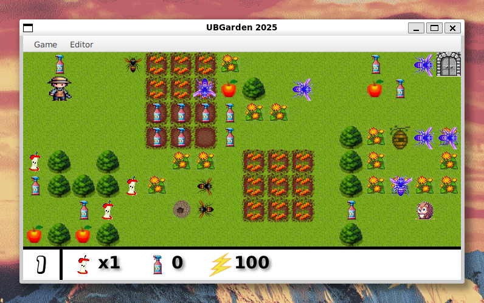

# UBGarden 2025 - 2D JavaFX Game Engine


**UBGarden** is a 2D tile-based puzzle/action game developed as part of an Advanced Object-Oriented Programming academic project (L2 Informatique / Computer Science, year 2024/2025) at the University of Bordeaux. 



The game features a custom-built JavaFX Game Engine, entity component interactions, dynamic level transitions, and enemy AI. The player controls a gardener who must navigate through infested gardens, collect carrots to open doors, survive insect attacks, and ultimately rescue a hidden hedgehog.

## Author
**Mohammed Squalli Houssaini**

*L3 MIAGE (Computer Science and Business Management) at the University of Bordeaux*


## Gameplay Features
* **Custom Game Loop**: Runs on a 60 FPS JavaFX `AnimationTimer` handling rendering, physics, and input processing.
* **Map Parsing & RLE Compression**: The engine parses levels from `.properties` files. It includes a custom decoder for Run-Length Encoding (RLE) to load compressed map strings efficiently.
* **Multi-Level Worlds**: Dynamic transitions between interconnected levels using doors.
* **Entity System & Collision**: 
  * Pickups: Energy boosts (Apples), Carrots (Keys), Insecticides.
  * Hazards: Poisoned Apples (gradually multiply movement energy cost).
  * Enemies: Wasps and Hornets spawning dynamically from nests with randomized AI movement.
* **Combat & Survival**: The gardener consumes energy while walking. Enemies deal damage upon collision, but the player can use collected insecticide bombs to fight back.

## Software Architecture Highlights
This project was designed with strong **OOP principles** to ensure maintainability and scalability:
* **Design Patterns**: 
  * *Factory Pattern* (`SpriteFactory`, `ImageResourceFactory`) for dynamic rendering.
  * *Singleton Pattern* to manage game configurations and resources.
  * *Visitor Pattern* (`PickupVisitor`, `WalkVisitor`) to resolve entity interactions cleanly without massive `if/else` chains.
* **Interface-driven Design**: Usage of `Walkable`, `Pickupable`, and `Movable` contracts to strictly define Entity capabilities.
* **Separation of Concerns**: Strict separation between the Game Logic (Model), Engine (Controller), and JavaFX Sprites (View).

## How to Run

### Prerequisites
* Java Development Kit (JDK) 17
* Gradle (or use the provided wrapper)

### Installation & Execution (Linux/WSL/macOS/Windows)
1. Clone the repository:
   ```bash
   git clone https://github.com/msq15/UBGarden-student-2025.git
   cd UBGarden-student-2025
   ```
2. Make the Gradle wrapper executable (Linux/macOS/WSL only):
   ```bash
   chmod +x gradlew
   ```
3. Run the application using Gradle:
   ```bash
   ./gradlew run
   ```

### Controls
* **Arrow Keys** (`↑`, `↓`, `←`, `→`): Move the gardener.
* **Escape** (`Esc`): Exit the game.
* *Note*: Insecticides are used automatically upon collision with an insect if available in the inventory.

## Project Structure
```text
src/main/java/fr/ubx/poo/ubgarden/
├── game/
│   ├── engine/       # Core game loop, input handling, and collision detection
│   ├── go/           # Game Objects (Movable, Pickupable, Walkable interfaces)
│   │   ├── bonus/    # Pickups (Apples, Carrots, Insecticides)
│   │   ├── decor/    # Static map elements (Grass, Trees, Doors, Nests)
│   │   └── personage/# Entities (Gardener, Wasps, Hornets)
│   ├── launcher/     # Configuration & Map parsing (.properties files)
│   └── view/         # JavaFX rendering, Sprite and Image factories
└── Main.java         # Application Entry Point
```
